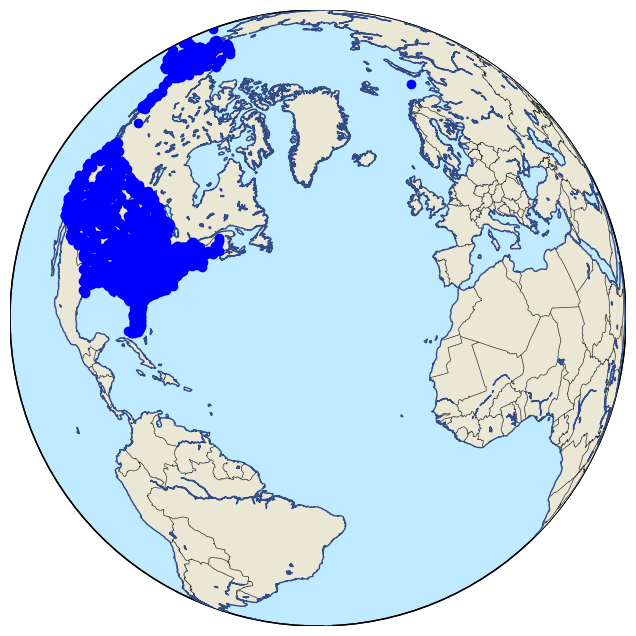

```python
print("teste do ambiente")
```

    teste do ambiente


```python
from pyspark.sql import SparkSession
spark = SparkSession.builder.appName("Spark-etl").getOrCreate()
```

    Setting default log level to "WARN".
    To adjust logging level use sc.setLogLevel(newLevel). For SparkR, use setLogLevel(newLevel).
    24/06/13 15:22:50 WARN NativeCodeLoader: Unable to load native-hadoop library for your platform... using builtin-java classes where applicable


```python
import requests
import tempfile

# File ID on Google Drive
file_id = '1s5WHBz59d4v8I96CSRlqR9DWTsSU6HC_'

def extractFile(file_id, chosen_name):
    """Extracts a file from Google Drive and saves the data into a PySpark DataFrame.
    
    Args:
        file_id (str): The file ID on Google Drive.
        chosen_name (str): The chosen name to assign to the DataFrame.
    
    Returns:
        pyspark.sql.DataFrame: The DataFrame containing the file data.
    """
    url = f"https://drive.google.com/uc?id={file_id}"
    try:
        response = requests.get(url)
        response.raise_for_status()  # Raises an error for unsuccessful responses
        
        # Creating a temporary file
        with tempfile.NamedTemporaryFile(delete=False, suffix=".csv") as temp_file:
            temp_file.write(response.content)
            temp_file_path = temp_file.name
        
        # Reading the CSV file with PySpark
        df = spark.read.csv(temp_file_path, header=True)
        
        # Showing the data
        df.show()
        
        # Assigning the DataFrame to a variable with the provided name
        globals()[chosen_name] = df
        
        return df
    
    except requests.RequestException as e:
        print(f"Error accessing the file: {e}")

extractFile(file_id, 'airports')

```

    +---+--------------------+----------------+-----------------+----+---+---+
    |faa|                name|             lat|              lon| alt| tz|dst|
    +---+--------------------+----------------+-----------------+----+---+---+
    |04G|   Lansdowne Airport|      41.1304722|      -80.6195833|1044| -5|  A|
    |06A|Moton Field Munic...|      32.4605722|      -85.6800278| 264| -5|  A|
    |06C| Schaumburg Regional|      41.9893408|      -88.1012428| 801| -6|  A|
    |06N|     Randall Airport|       41.431912|      -74.3915611| 523| -5|  A|
    |09J|Jekyll Island Air...|      31.0744722|      -81.4277778|  11| -4|  A|
    |0A9|Elizabethton Muni...|      36.3712222|      -82.1734167|1593| -4|  A|
    |0G6|Williams County A...|      41.4673056|      -84.5067778| 730| -5|  A|
    |0G7|Finger Lakes Regi...|      42.8835647|      -76.7812318| 492| -5|  A|
    |0P2|Shoestring Aviati...|      39.7948244|      -76.6471914|1000| -5|  U|
    |0S9|Jefferson County ...|      48.0538086|     -122.8106436| 108| -8|  A|
    |0W3|Harford County Ai...|      39.5668378|      -76.2024028| 409| -5|  A|
    |10C|  Galt Field Airport|      42.4028889|      -88.3751111| 875| -6|  U|
    |17G|Port Bucyrus-Craw...|      40.7815556|      -82.9748056|1003| -5|  A|
    |19A|Jackson County Ai...|      34.1758638|      -83.5615972| 951| -4|  U|
    |1A3|Martin Campbell F...|      35.0158056|      -84.3468333|1789| -4|  A|
    |1B9| Mansfield Municipal|      42.0001331|      -71.1967714| 122| -5|  A|
    |1C9|Frazier Lake Airpark|54.0133333333333|-124.768333333333| 152| -8|  A|
    |1CS|Clow Internationa...|      41.6959744|      -88.1292306| 670| -6|  U|
    |1G3|  Kent State Airport|      41.1513889|      -81.4151111|1134| -4|  A|
    |1OH|     Fortman Airport|      40.5553253|      -84.3866186| 885| -5|  U|
    +---+--------------------+----------------+-----------------+----+---+---+
    only showing top 20 rows
    


    DataFrame[faa: string, name: string, lat: string, lon: string, alt: string, tz: string, dst: string]


```python
# Rename the faa column
airports = airports.withColumnRenamed('faa','dest')
```


```python
import matplotlib.pyplot as plt
from mpl_toolkits.basemap import Basemap

# Convert latitude and longitude columns to float
airports = airports.withColumn("lat", airports["lat"].cast("float"))
airports = airports.withColumn("lon", airports["lon"].cast("float"))

# Enable the figure and set axes and title
fig = plt.figure(figsize=(10, 8))
ax = fig.add_subplot(1,1,1)
 
# Set the base map projection
m = Basemap(
    ax=ax,
    resolution='l',
    projection='ortho',  # Using the 'mill' projection to view the whole world
    lon_0 = -40, lat_0 = 35
    # llcrnrlon=-60, llcrnrlat=90,  # Lower left limits
    # urcrnrlon=-180, urcrnrlat=180,     # Upper right limits
)

# Set the vector layers to load as the base map
m.drawcountries(color='#303338')
m.drawmapboundary(fill_color='#c0eaff')
m.drawcoastlines(color='#324c87')
m.fillcontinents(color='#ebe7d5', lake_color='#c0eaff')

# Add markers for each airport
for row in airports.collect():
    x, y = m(row["lon"], row["lat"])  # Corrected to use m instead of mapa
    m.plot(x, y, 'bo', markersize=6)

plt.show()


```


    

    


```python
file_id2 = "1bJ8Nguso8mQPeAE4b_tUg6N_fwH8VmnN"

extractFile(file_id2, 'flights')
```

    +----+-----+---+--------+---------+--------+---------+-------+-------+------+------+----+--------+--------+----+------+
    |year|month|day|dep_time|dep_delay|arr_time|arr_delay|carrier|tailnum|flight|origin|dest|air_time|distance|hour|minute|
    +----+-----+---+--------+---------+--------+---------+-------+-------+------+------+----+--------+--------+----+------+
    |2014|   12|  8|     658|       -7|     935|       -5|     VX| N846VA|  1780|   SEA| LAX|     132|     954|   6|    58|
    |2014|    1| 22|    1040|        5|    1505|        5|     AS| N559AS|   851|   SEA| HNL|     360|    2677|  10|    40|
    |2014|    3|  9|    1443|       -2|    1652|        2|     VX| N847VA|   755|   SEA| SFO|     111|     679|  14|    43|
    |2014|    4|  9|    1705|       45|    1839|       34|     WN| N360SW|   344|   PDX| SJC|      83|     569|  17|     5|
    |2014|    3|  9|     754|       -1|    1015|        1|     AS| N612AS|   522|   SEA| BUR|     127|     937|   7|    54|
    |2014|    1| 15|    1037|        7|    1352|        2|     WN| N646SW|    48|   PDX| DEN|     121|     991|  10|    37|
    |2014|    7|  2|     847|       42|    1041|       51|     WN| N422WN|  1520|   PDX| OAK|      90|     543|   8|    47|
    |2014|    5| 12|    1655|       -5|    1842|      -18|     VX| N361VA|   755|   SEA| SFO|      98|     679|  16|    55|
    |2014|    4| 19|    1236|       -4|    1508|       -7|     AS| N309AS|   490|   SEA| SAN|     135|    1050|  12|    36|
    |2014|   11| 19|    1812|       -3|    2352|       -4|     AS| N564AS|    26|   SEA| ORD|     198|    1721|  18|    12|
    |2014|   11|  8|    1653|       -2|    1924|       -1|     AS| N323AS|   448|   SEA| LAX|     130|     954|  16|    53|
    |2014|    8|  3|    1120|        0|    1415|        2|     AS| N305AS|   656|   SEA| PHX|     154|    1107|  11|    20|
    |2014|   10| 30|     811|       21|    1038|       29|     AS| N433AS|   608|   SEA| LAS|     127|     867|   8|    11|
    |2014|   11| 12|    2346|       -4|     217|      -28|     AS| N765AS|   121|   SEA| ANC|     183|    1448|  23|    46|
    |2014|   10| 31|    1314|       89|    1544|      111|     AS| N713AS|   306|   SEA| SFO|     129|     679|  13|    14|
    |2014|    1| 29|    2009|        3|    2159|        9|     UA| N27205|  1458|   PDX| SFO|      90|     550|  20|     9|
    |2014|   12| 17|    2015|       50|    2150|       41|     AS| N626AS|   368|   SEA| SMF|      76|     605|  20|    15|
    |2014|    8| 11|    1017|       -3|    1613|       -7|     WN| N8634A|   827|   SEA| MDW|     216|    1733|  10|    17|
    |2014|    1| 13|    2156|       -9|     607|      -15|     AS| N597AS|    24|   SEA| BOS|     290|    2496|  21|    56|
    |2014|    6|  5|    1733|      -12|    1945|      -10|     OO| N215AG|  3488|   PDX| BUR|     111|     817|  17|    33|
    +----+-----+---+--------+---------+--------+---------+-------+-------+------+------+----+--------+--------+----+------+
    only showing top 20 rows
    


    DataFrame[year: string, month: string, day: string, dep_time: string, dep_delay: string, arr_time: string, arr_delay: string, carrier: string, tailnum: string, flight: string, origin: string, dest: string, air_time: string, distance: string, hour: string, minute: string]


```python
# Join the DataFrames using the "origin" column from the `flights` DataFrame and the "faa" column from the `airports` DataFrame
airports_flights = flights.join(airports, on="dest", how='leftouter')

# Display the resulting DataFrame
airports_flights.show(5)
```

    +----+----+-----+---+--------+---------+--------+---------+-------+-------+------+------+--------+--------+----+------+--------------------+---------+-----------+---+---+---+
    |dest|year|month|day|dep_time|dep_delay|arr_time|arr_delay|carrier|tailnum|flight|origin|air_time|distance|hour|minute|                name|      lat|        lon|alt| tz|dst|
    +----+----+-----+---+--------+---------+--------+---------+-------+-------+------+------+--------+--------+----+------+--------------------+---------+-----------+---+---+---+
    | LAX|2014|   12|  8|     658|       -7|     935|       -5|     VX| N846VA|  1780|   SEA|     132|     954|   6|    58|    Los Angeles Intl|33.942535| -118.40807|126| -8|  A|
    | HNL|2014|    1| 22|    1040|        5|    1505|        5|     AS| N559AS|   851|   SEA|     360|    2677|  10|    40|       Honolulu Intl|21.318682| -157.92242| 13|-10|  N|
    | SFO|2014|    3|  9|    1443|       -2|    1652|        2|     VX| N847VA|   755|   SEA|     111|     679|  14|    43|  San Francisco Intl|37.618973|-122.374886| 13| -8|  A|
    | SJC|2014|    4|  9|    1705|       45|    1839|       34|     WN| N360SW|   344|   PDX|      83|     569|  17|     5|Norman Y Mineta S...|  37.3626| -121.92902| 62| -8|  A|
    | BUR|2014|    3|  9|     754|       -1|    1015|        1|     AS| N612AS|   522|   SEA|     127|     937|   7|    54|            Bob Hope| 34.20067|-118.358665|778| -8|  A|
    +----+----+-----+---+--------+---------+--------+---------+-------+-------+------+------+--------+--------+----+------+--------------------+---------+-----------+---+---+---+
    only showing top 5 rows
    


```python
from pyspark.sql.functions import count
from pyspark.sql.functions import desc

# Count the number of flights departing from each airport
departing_flights = airports_flights.groupBy("origin").agg(count("*").alias("departing_flights"))

# Count the number of flights arriving at each airport
arriving_flights = airports_flights.groupBy("dest").agg(count("*").alias("arriving_flights")).orderBy(desc("arriving_flights"))

# Display the results
print("Number of flights departing from each airport:")
departing_flights.show()

print("Number of flights arriving at each airport:")
arriving_flights.show(10)

```

    Number of flights departing from each airport:
    +------+-----------------+
    |origin|departing_flights|
    +------+-----------------+
    |   SEA|             6754|
    |   PDX|             3246|
    +------+-----------------+
    
    Number of flights arriving at each airport:
    +----+----------------+
    |dest|arriving_flights|
    +----+----------------+
    | SFO|             787|
    | LAX|             615|
    | DEN|             586|
    | PHX|             530|
    | LAS|             520|
    | ANC|             449|
    | ORD|             439|
    | SLC|             396|
    | DFW|             371|
    | SJC|             369|
    +----+----------------+
    only showing top 10 rows
    


```python
from pyspark.sql.functions import avg

# Calculate the average departure delay
average_departure_delay = airports_flights.agg(avg("dep_delay")).collect()[0][0]

# Calculate the average arrival delay
average_arrival_delay = airports_flights.agg(avg("arr_delay")).collect()[0][0]

# Display the results
print("Average departure delay:", round(average_departure_delay, 2), "minutes")
print("Average arrival delay:", round(average_arrival_delay, 2), "minutes")

```

    Average departure delay: 6.07 minutes
    Average arrival delay: 2.25 minutes


```python
from pyspark.sql.functions import month

# Stratify delay by airport and month of the year
delay_by_airport_month = airports_flights.groupBy("month", "origin") \
    .agg(avg("dep_delay").alias("average_departure_delay"), avg("arr_delay").alias("average_arrival_delay")) \
    .orderBy("average_departure_delay", "average_arrival_delay")

# Display the results
delay_by_airport_month.show(24)

```

    +-----+------+-----------------------+---------------------+
    |month|origin|average_departure_delay|average_arrival_delay|
    +-----+------+-----------------------+---------------------+
    |    5|   PDX|     2.3509433962264152|  -0.3712121212121212|
    |   11|   PDX|     2.8048780487804876|   -3.093877551020408|
    |    3|   PDX|      2.963636363636364|  -0.8357664233576643|
    |    5|   SEA|      3.388214904679376|   0.1857638888888889|
    |   10|   SEA|      3.918669131238447|   0.8170055452865065|
    |    4|   SEA|      4.066914498141264|  0.32710280373831774|
    |    9|   SEA|      4.075862068965518|    1.389655172413793|
    |    7|   PDX|      4.082802547770701| -0.22611464968152867|
    |   10|   PDX|       4.14760147601476|    0.662962962962963|
    |    8|   PDX|      4.493827160493828|   1.7006172839506173|
    |    6|   PDX|      5.322695035460993|    1.416370106761566|
    |    1|   PDX|      5.353383458646617|   0.8150943396226416|
    |   11|   SEA|       5.74859287054409|   -0.543233082706767|
    |    9|   PDX|      6.448818897637795|   2.0988142292490117|
    |    3|   SEA|      6.516569200779727|   1.3586744639376218|
    |    1|   SEA|      6.953091684434968|   0.9528907922912205|
    |    6|   SEA|      7.239669421487603|    4.176079734219269|
    |    8|   SEA|      7.273097826086956|    5.186648501362398|
    |    7|   SEA|      8.233333333333333|    5.455235204855843|
    |    4|   PDX|      8.938628158844764|    3.963636363636364|
    |    2|   SEA|      9.023923444976077|   1.4052757793764987|
    |   12|   SEA|      9.660682226211849|     7.81981981981982|
    |   12|   PDX|      10.05327868852459|    7.172131147540983|
    |    2|   PDX|     11.101449275362318|    7.697560975609756|
    +-----+------+-----------------------+---------------------+
    


```python
file_id3 = "1nWR3JWNCTByX725WU2nUaibDX70QBhpu"

extractFile(file_id3, "planes")
```

    +-------+----+--------------------+----------------+--------+-------+-----+-----+---------+
    |tailnum|year|                type|    manufacturer|   model|engines|seats|speed|   engine|
    +-------+----+--------------------+----------------+--------+-------+-----+-----+---------+
    | N102UW|1998|Fixed wing multi ...|AIRBUS INDUSTRIE|A320-214|      2|  182|   NA|Turbo-fan|
    | N103US|1999|Fixed wing multi ...|AIRBUS INDUSTRIE|A320-214|      2|  182|   NA|Turbo-fan|
    | N104UW|1999|Fixed wing multi ...|AIRBUS INDUSTRIE|A320-214|      2|  182|   NA|Turbo-fan|
    | N105UW|1999|Fixed wing multi ...|AIRBUS INDUSTRIE|A320-214|      2|  182|   NA|Turbo-fan|
    | N107US|1999|Fixed wing multi ...|AIRBUS INDUSTRIE|A320-214|      2|  182|   NA|Turbo-fan|
    | N108UW|1999|Fixed wing multi ...|AIRBUS INDUSTRIE|A320-214|      2|  182|   NA|Turbo-fan|
    | N109UW|1999|Fixed wing multi ...|AIRBUS INDUSTRIE|A320-214|      2|  182|   NA|Turbo-fan|
    | N110UW|1999|Fixed wing multi ...|AIRBUS INDUSTRIE|A320-214|      2|  182|   NA|Turbo-fan|
    | N111US|1999|Fixed wing multi ...|AIRBUS INDUSTRIE|A320-214|      2|  182|   NA|Turbo-fan|
    | N11206|2000|Fixed wing multi ...|          BOEING| 737-824|      2|  149|   NA|Turbo-fan|
    | N112US|1999|Fixed wing multi ...|AIRBUS INDUSTRIE|A320-214|      2|  182|   NA|Turbo-fan|
    | N113UW|1999|Fixed wing multi ...|AIRBUS INDUSTRIE|A320-214|      2|  182|   NA|Turbo-fan|
    | N114UW|1999|Fixed wing multi ...|AIRBUS INDUSTRIE|A320-214|      2|  182|   NA|Turbo-fan|
    | N117UW|2000|Fixed wing multi ...|AIRBUS INDUSTRIE|A320-214|      2|  182|   NA|Turbo-fan|
    | N118US|2000|Fixed wing multi ...|AIRBUS INDUSTRIE|A320-214|      2|  182|   NA|Turbo-fan|
    | N119US|2000|Fixed wing multi ...|AIRBUS INDUSTRIE|A320-214|      2|  182|   NA|Turbo-fan|
    | N1200K|1998|Fixed wing multi ...|          BOEING| 767-332|      2|  330|   NA|Turbo-fan|
    | N1201P|1998|Fixed wing multi ...|          BOEING| 767-332|      2|  330|   NA|Turbo-fan|
    | N12114|1995|Fixed wing multi ...|          BOEING| 757-224|      2|  178|   NA|Turbo-jet|
    | N121DE|1987|Fixed wing multi ...|          BOEING| 767-332|      2|  330|   NA|Turbo-fan|
    +-------+----+--------------------+----------------+--------+-------+-----+-----+---------+
    only showing top 20 rows
    


    DataFrame[tailnum: string, year: string, type: string, manufacturer: string, model: string, engines: string, seats: string, speed: string, engine: string]


```python
# Rename year column on panes to avoid duplicate column name
planes = planes.withColumnRenamed('year', 'plane_year')
```


```python
#join the flights and plane table use key as tailnum column
model_data = airports_flights.join(planes, on='tailnum', how='leftouter')
model_data.show(5)
```

    +-------+----+----+-----+---+--------+---------+--------+---------+-------+------+------+--------+--------+----+------+--------------------+---------+-----------+---+---+---+----------+--------------------+------------+--------+-------+-----+-----+---------+
    |tailnum|dest|year|month|day|dep_time|dep_delay|arr_time|arr_delay|carrier|flight|origin|air_time|distance|hour|minute|                name|      lat|        lon|alt| tz|dst|plane_year|                type|manufacturer|   model|engines|seats|speed|   engine|
    +-------+----+----+-----+---+--------+---------+--------+---------+-------+------+------+--------+--------+----+------+--------------------+---------+-----------+---+---+---+----------+--------------------+------------+--------+-------+-----+-----+---------+
    | N846VA| LAX|2014|   12|  8|     658|       -7|     935|       -5|     VX|  1780|   SEA|     132|     954|   6|    58|    Los Angeles Intl|33.942535| -118.40807|126| -8|  A|      2011|Fixed wing multi ...|      AIRBUS|A320-214|      2|  182|   NA|Turbo-fan|
    | N559AS| HNL|2014|    1| 22|    1040|        5|    1505|        5|     AS|   851|   SEA|     360|    2677|  10|    40|       Honolulu Intl|21.318682| -157.92242| 13|-10|  N|      2006|Fixed wing multi ...|      BOEING| 737-890|      2|  149|   NA|Turbo-fan|
    | N847VA| SFO|2014|    3|  9|    1443|       -2|    1652|        2|     VX|   755|   SEA|     111|     679|  14|    43|  San Francisco Intl|37.618973|-122.374886| 13| -8|  A|      2011|Fixed wing multi ...|      AIRBUS|A320-214|      2|  182|   NA|Turbo-fan|
    | N360SW| SJC|2014|    4|  9|    1705|       45|    1839|       34|     WN|   344|   PDX|      83|     569|  17|     5|Norman Y Mineta S...|  37.3626| -121.92902| 62| -8|  A|      1992|Fixed wing multi ...|      BOEING| 737-3H4|      2|  149|   NA|Turbo-fan|
    | N612AS| BUR|2014|    3|  9|     754|       -1|    1015|        1|     AS|   522|   SEA|     127|     937|   7|    54|            Bob Hope| 34.20067|-118.358665|778| -8|  A|      1999|Fixed wing multi ...|      BOEING| 737-790|      2|  151|   NA|Turbo-jet|
    +-------+----+----+-----+---+--------+---------+--------+---------+-------+------+------+--------+--------+----+------+--------------------+---------+-----------+---+---+---+----------+--------------------+------------+--------+-------+-----+-----+---------+
    only showing top 5 rows
    


```python
model_data = model_data.withColumn('arr_delay', model_data.arr_delay.cast('integer'))
model_data = model_data.withColumn('air_time' , model_data.air_time.cast('integer'))
model_data = model_data.withColumn('month', model_data.month.cast('integer'))
model_data = model_data.withColumn('plane_year', model_data.plane_year.cast('integer'))
```


```python
model_data.describe('arr_delay', 'air_time','month', 'plane_year').show()
```

    +-------+------------------+------------------+------------------+-----------------+
    |summary|         arr_delay|          air_time|             month|       plane_year|
    +-------+------------------+------------------+------------------+-----------------+
    |  count|              9925|              9925|             10000|             9354|
    |   mean|2.2530982367758186|152.88423173803525|            6.6438|2001.594398118452|
    | stddev|31.074918600451877|  72.8656286392139|3.3191600205962097|58.92921992728455|
    |    min|               -58|                20|                 1|                0|
    |    max|               900|               409|                12|             2014|
    +-------+------------------+------------------+------------------+-----------------+
    


```python
# Create a new column
model_data =model_data.withColumn('plane_age', model_data.year - model_data.plane_year)
```


```python
model_data = model_data.withColumn('is_late', model_data.arr_delay >0)

model_data = model_data.withColumn('label', model_data.is_late.cast('integer'))

model_data.filter("arr_delay is not NULL and dep_delay is not NULL and air_time is not NULL and plane_year is not NULL")
```


    DataFrame[tailnum: string, dest: string, year: string, month: int, day: string, dep_time: string, dep_delay: string, arr_time: string, arr_delay: int, carrier: string, flight: string, origin: string, air_time: int, distance: string, hour: string, minute: string, name: string, lat: float, lon: float, alt: string, tz: string, dst: string, plane_year: int, type: string, manufacturer: string, model: string, engines: string, seats: string, speed: string, engine: string, plane_age: double, is_late: boolean, label: int]


```python
from pyspark.ml.feature import StringIndexer, OneHotEncoder

#Create a StringIndexer
carr_indexer = StringIndexer(inputCol='carrier', outputCol='carrier_index')
#Create a OneHotEncoder
carr_encoder = OneHotEncoder(inputCol='carrier_index', outputCol='carr_fact')
# encode the dest column just like you did above
dest_indexer = StringIndexer(inputCol='dest', outputCol='dest_index')
dest_encoder = OneHotEncoder(inputCol='dest_index', outputCol='dest_fact')
```


```python
# Assemble a  Vector
from pyspark.ml.feature import  VectorAssembler

vec_assembler =VectorAssembler(inputCols=['month', 'air_time','carr_fact','dest_fact','plane_age'],
                              outputCol='features',handleInvalid="skip")
```


```python
# #### Create the pipeline
# Pipeline is a class in the `pyspark.ml module` that combines all the Estimators and Transformers that you've 
# already created.

from pyspark.ml import Pipeline

flights_pipe = Pipeline(stages=[dest_indexer, dest_encoder, carr_indexer, carr_encoder, vec_assembler])

piped_data =flights_pipe.fit(model_data).transform(model_data)

piped_data.show(5)
```

    +-------+----+----+-----+---+--------+---------+--------+---------+-------+------+------+--------+--------+----+------+--------------------+---------+-----------+---+---+---+----------+--------------------+------------+--------+-------+-----+-----+---------+---------+-------+-----+----------+---------------+-------------+--------------+--------------------+
    |tailnum|dest|year|month|day|dep_time|dep_delay|arr_time|arr_delay|carrier|flight|origin|air_time|distance|hour|minute|                name|      lat|        lon|alt| tz|dst|plane_year|                type|manufacturer|   model|engines|seats|speed|   engine|plane_age|is_late|label|dest_index|      dest_fact|carrier_index|     carr_fact|            features|
    +-------+----+----+-----+---+--------+---------+--------+---------+-------+------+------+--------+--------+----+------+--------------------+---------+-----------+---+---+---+----------+--------------------+------------+--------+-------+-----+-----+---------+---------+-------+-----+----------+---------------+-------------+--------------+--------------------+
    | N846VA| LAX|2014|   12|  8|     658|       -7|     935|       -5|     VX|  1780|   SEA|     132|     954|   6|    58|    Los Angeles Intl|33.942535| -118.40807|126| -8|  A|      2011|Fixed wing multi ...|      AIRBUS|A320-214|      2|  182|   NA|Turbo-fan|      3.0|  false|    0|       1.0| (68,[1],[1.0])|          8.0|(10,[8],[1.0])|(81,[0,1,10,13,80...|
    | N559AS| HNL|2014|    1| 22|    1040|        5|    1505|        5|     AS|   851|   SEA|     360|    2677|  10|    40|       Honolulu Intl|21.318682| -157.92242| 13|-10|  N|      2006|Fixed wing multi ...|      BOEING| 737-890|      2|  149|   NA|Turbo-fan|      8.0|   true|    1|      22.0|(68,[22],[1.0])|          0.0|(10,[0],[1.0])|(81,[0,1,2,34,80]...|
    | N847VA| SFO|2014|    3|  9|    1443|       -2|    1652|        2|     VX|   755|   SEA|     111|     679|  14|    43|  San Francisco Intl|37.618973|-122.374886| 13| -8|  A|      2011|Fixed wing multi ...|      AIRBUS|A320-214|      2|  182|   NA|Turbo-fan|      3.0|   true|    1|       0.0| (68,[0],[1.0])|          8.0|(10,[8],[1.0])|(81,[0,1,10,12,80...|
    | N360SW| SJC|2014|    4|  9|    1705|       45|    1839|       34|     WN|   344|   PDX|      83|     569|  17|     5|Norman Y Mineta S...|  37.3626| -121.92902| 62| -8|  A|      1992|Fixed wing multi ...|      BOEING| 737-3H4|      2|  149|   NA|Turbo-fan|     22.0|   true|    1|       9.0| (68,[9],[1.0])|          1.0|(10,[1],[1.0])|(81,[0,1,3,21,80]...|
    | N612AS| BUR|2014|    3|  9|     754|       -1|    1015|        1|     AS|   522|   SEA|     127|     937|   7|    54|            Bob Hope| 34.20067|-118.358665|778| -8|  A|      1999|Fixed wing multi ...|      BOEING| 737-790|      2|  151|   NA|Turbo-jet|     15.0|   true|    1|      23.0|(68,[23],[1.0])|          0.0|(10,[0],[1.0])|(81,[0,1,2,35,80]...|
    +-------+----+----+-----+---+--------+---------+--------+---------+-------+------+------+--------+--------+----+------+--------------------+---------+-----------+---+---+---+----------+--------------------+------------+--------+-------+-----+-----+---------+---------+-------+-----+----------+---------------+-------------+--------------+--------------------+
    only showing top 5 rows
    


```python
training, test = piped_data.randomSplit([.6, .4])
```


```python
from pyspark.ml.classification import LogisticRegression

lr = LogisticRegression()
```


```python
# #### Create the evaluator
# The first thing you need when doing cross validation for model selection is a way to compare different models. Luckily,
# the pyspark.ml.evaluation submodule has classes for evaluating different kinds of models. Your model is a binary
# classification model, so you'll be using the `BinaryClassificationEvaluator` from the `pyspark.ml.evaluation` module.
# This evaluator calculates the area under the ROC. This is a metric that combines the two kinds of errors a binary classifier
# can make (false positives and false negatives) into a simple number.

import pyspark.ml.evaluation as evals

evaluator = evals.BinaryClassificationEvaluator(metricName='areaUnderROC')
```


```python
# Import the tuning submodule
import numpy as np
import pyspark.ml.tuning as tune

# Create the parameter grid
grid = tune.ParamGridBuilder()

# Add the hyperparameter
grid = grid.addGrid(lr.regParam, np.arange(0, .1, .01))
grid = grid.addGrid(lr.elasticNetParam, [0,1])

# Build the grid
grid = grid.build()

# Create the CrossValidator
cv = tune.CrossValidator(estimator=lr,
               estimatorParamMaps=grid,
               evaluator=evaluator
               )

# Fit cross validation models
models = cv.fit(training)

# Extract the best model
best_lr = models.bestModel

# Use the model to predict the test set
test_results = best_lr.transform(test)
# 
# Evaluate the predictions
print(evaluator.evaluate(test_results))
```

    0.6887509068274581

